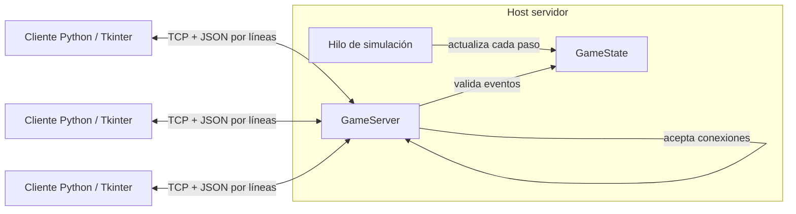
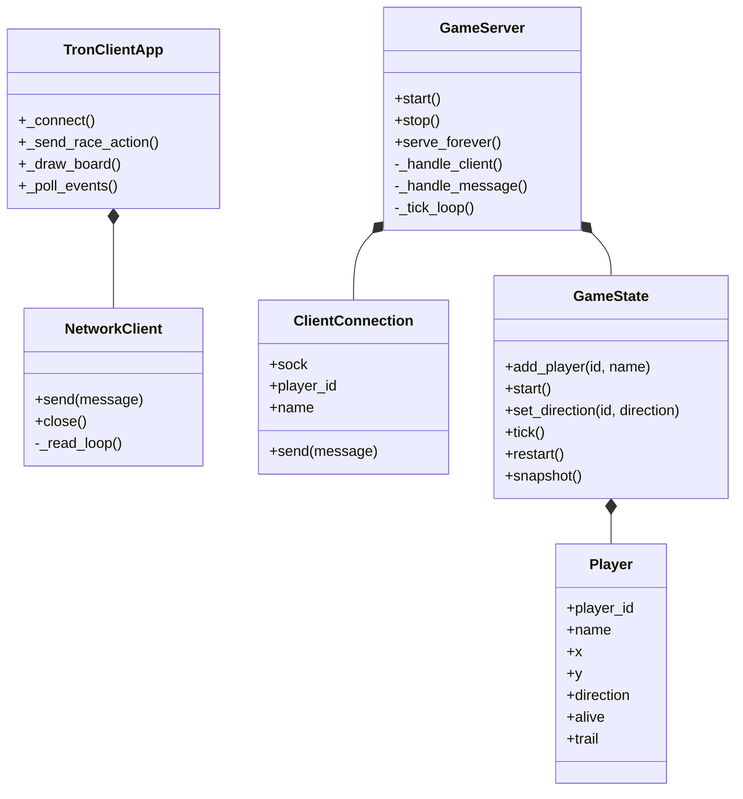
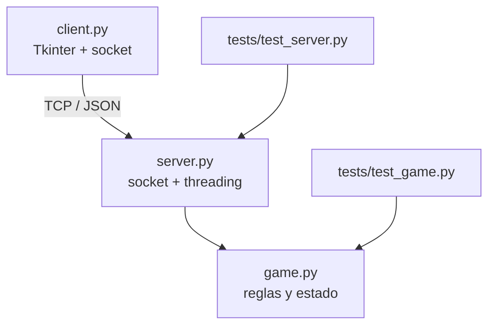

# Arquitectura del sistema

## Resumen

El sistema usa una arquitectura cliente-servidor. El servidor mantiene el único estado válido de la partida; los clientes envían intenciones de giro y dibujan las instantáneas que reciben. La comunicación se implementa con sockets TCP tradicionales (`AF_INET`/`SOCK_STREAM`), no con WebSockets.



El servidor puede ejecutarse en Linux, Windows o macOS. Los clientes pueden usar otro sistema operativo: el protocolo intercambia JSON UTF-8 delimitado por saltos de línea sobre TCP y no depende de la representación binaria local. El servidor escucha en `0.0.0.0:5050` por omisión.

## Hilos y sincronización

- El hilo principal del servidor acepta conexiones TCP.
- Cada cliente conectado se atiende en un hilo independiente: recibe comandos y gestiona la desconexión.
- Un hilo de simulación avanza la partida a la frecuencia configurada y transmite instantáneas.
- `GameServer.lock` protege las operaciones compartidas sobre la sala. Un paso completo de simulación, la aplicación de un comando y la creación de la instantánea se serializan bajo ese bloqueo.
- Cada conexión tiene un `send_lock`, que evita intercalar mensajes escritos desde hilos distintos.
- En el cliente, un hilo lector recibe mensajes. Los deposita en una cola; el hilo de Tkinter consume la cola y actualiza widgets, ya que Tkinter no es seguro para manipular desde hilos secundarios.

## Flujo de mensajes

Cada mensaje ocupa una línea JSON UTF-8 terminada en `\n`. El primer mensaje debe ser `join`:

```json
{"type":"join","name":"Ada"}
```

El servidor responde con `welcome` y una instantánea. Durante la sesión transmite mensajes `state`; el cliente puede enviar `start`, `restart` y eventos de dirección como `{"type":"direction","direction":"left"}`. Los errores de protocolo o de estado se devuelven como `error`. Las instantáneas contienen fase (`lobby`, `running` o `finished`), dimensiones, ganador y posiciones/estelas de los jugadores.

## Diseño de clases



## Dependencias entre módulos



`game.py` no depende de red ni de interfaz gráfica, lo que permite probar las reglas de manera aislada. `server.py` depende del modelo y de la biblioteca estándar. `client.py` depende de Tkinter y sockets. Las pruebas utilizan `unittest` y sockets locales.

## Persistencia y seguridad

No se incorpora base de datos: jugadores, sala y resultados solo existen durante la ejecución del servidor, por lo que almacenar datos no es necesario para las mecánicas solicitadas. La sala limita las conexiones a seis jugadores y los nombres a 16 caracteres. Esta versión no implementa cuentas, cifrado ni protección contra clientes maliciosos; está pensada para una práctica en una red controlada. Para jugar entre redes, además de abrir el puerto, se recomienda desplegar el servidor en una red accesible y limitar las reglas del firewall a los clientes esperados.